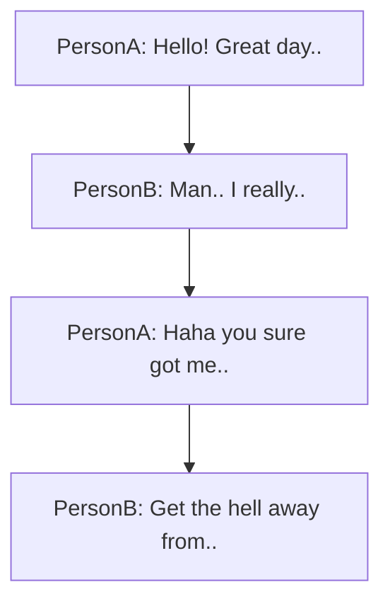

# Overview 

Halcyon is the ultimate script for producing rich and reactive interactive fiction.


Here's what we aim to provide. by v0.5.0

#### 📜 A simple language

- Inspired by Renpy, author content in a syntax that is a joy to write in.
- Incredibly powerful and simple scripting system.
- Text-based source file management.

```
George: Hello! how are you?
    Emilia > I'm doing great!
        George: Wonderful!
    Emilia > Uhh not so well.
        George: Huh, well why don't you tell me what's going on?
        @goto emilia_explains_her_problem
```

#### 📜 A beautiful runtime

- Games are demanding for performance. Thats why this runtime is natively written in zig ⚡, it features no garbage collection, minimal memory footprint, and puts you in charge of it's compute.
- Don't pay for what you don't use, the event system can be completely turned off.  Debug features can be stripped from production builds.
- A lighting fast data oriented architecture and ECS runtime, hot-reload scripts while you're playing.
- No dependencies. Other than the zig standard library, no messy dependencies are brought into your system

#### 📜 Debugging for everyone

- Get superpowers with the halcyon debugger. Debug game instances, step forward, and backwards, edit quest facts.
- Connect to remote instances via a debug server architecture.
- Debug multiplayer sessions, save and load gamestates.

#### 📜 Quality at every step of production
- Databases and spreadsheets for localization can be generated with a click of a button. All text is locally tagged with keys for localization.
- Manage auxilary content such as recordings directly within project files.
- Bake and cook entire games with hundreds of thousands of lines of text into compact, production ready shippable binaries.
- Goal is to be in use in AA and AAA companies.

#### 📜 Seamless integration with your projects

- Plugins and prebuilt asset packages for Unreal Engine and Unity, will be available through the asset store and marketplace.
- Sane defaults and rich examples lets you get started with writing right away.

#### 📜 An open ecosystem

- Written in zig, a next-generation systems programming language that provides actual super powers, the runtime cross compiles for all modern systems including android, IOS and Consoles (bring your own sdk).
- The runtime and parser are entirely open source. Write your extensions and tools and have them be compiled natively.
- An open C Header API is published as well for you to write your own bindings.
- Write your own plugins and extensions onto the system, default distrobutions of the runtime come with the editor and the zig compiler.

### Development

The tool is currently in development by just me, Peterino. I am an engine and tools developer who works in the AAA gamedev space and wanted to have an elegant solution for my personal projects that is comparable or better to the tools I am familiar with at work.

# The language

The scripting language is loosely inspired by renpy. To declare a stream of dialogue, simply write it like thus.

```
PersonA: Hello! Great day isn't it?
PersonB: Man.. I really hate the way you talk so nicely.
PersonA: Haha you sure got me there! I really am a nice person.
PersonB: Get the hell away from me.
```


Dialogues can be written with with just the format \[Speaker\] : \[content\]
and each dialogue ends with a newline.

```
PersonA: This is a really long piece of dialogue 
: So I can extend it like this
```

### Conditionals

Single dialogue can be decorated with an if statement.

```
@if(PersonA_is_pissed)
PersonA: I am pissed off
PersonA: I will say this line regardless of if I'm pissed off or not.
```

Groups of dialogues can be gated by a tab-indent statements.

```
@if(PersonA_is_pissed)
    PersonA: I am really pissed off
    PersonB: If you're pissed off so am I!
PersonA: I will say this line regardless of if I'm pissed off or not.
```


### Variables

Variables are defined or imported at the top of each .halc file. with the `@vars` directive.

```
@vars(
    import PersonA; # This imports the PersonA namespace 
    # This defines a variable in the PersonA namespace
    def PersonAIsPissed = false; 
    # This defines a variable in the PersonA namespace
    def PersonA.isPissed = false; 
    # generally I'd recommend having the character definition 
    # wherever it is also defining all of it's variables

    # if def for the same variable from a global namespace name
    # is called more than once
)
```

#### namespaces

```
@vars{
    namespace PersonA{ 
        # this defines a namespace and can be accessed via a dot specifier.
        
    };
}
```

#### characters

To define a character, you declare it in a `@vars` like this.

The `name` variable will be used for the speaker name.

```
@vars {
    character PersonA { 
        def name = "I have a really long name"; 
    };
}
```


## The Runtime

`Warning, nerd stuff ahead!`

#### language runtime in detail

```
@if(PersonA_is_pissed)
PersonA: I am pissed off
PersonA: I will say this line regardless of if I'm pissed off or not.
```

